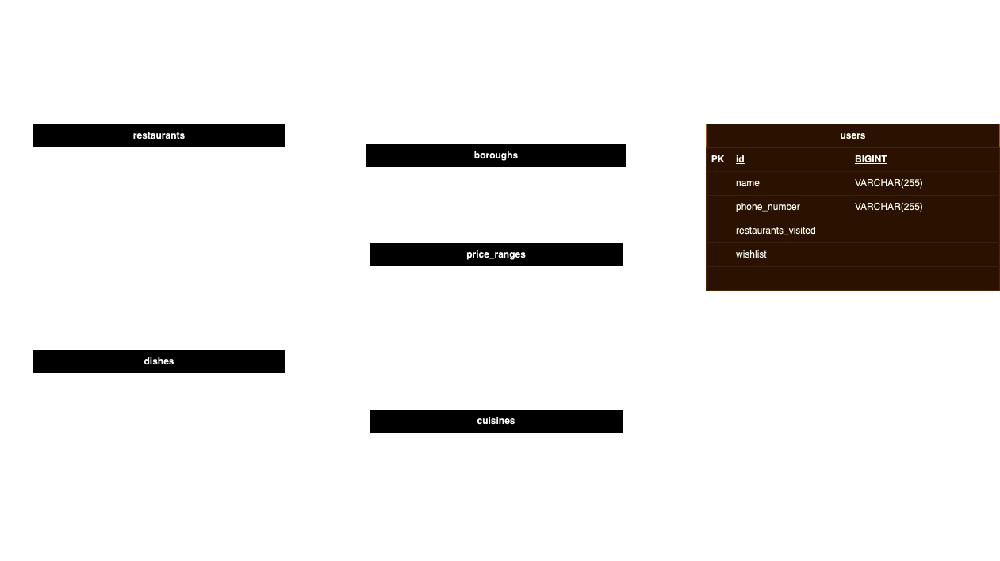

# Anna's Restaurant Recommender - ARE YOU HUNGRY? JUST SEARCH 
## Description
This is a data API project which recommends London restaurants based on location and cuisine. Each restaurant contains a borough, cuisine, price range and rating (out of 5), as well as a list of dishes that are served. Dishes are characterised by whether they meet certain dietary requirements, such as being halal or vegetarian. 

The program allows for the user to be recommended restaurants based on their borough of choice, cuisine of choice, or both borough and cuisine at once. 

## MVP

Each model - Restaurant and Dish - have REST controllers that provide basic CRUD functionality:

**For Restaurants:**
- Create a new restaurant 
- Display all available restaurants
- Display details of a specific restaurant
- Update the details of a specific restaurant
- Delete a restaurant

**For Dishes:**
- Create a new dish
- Display all available dishes
- Display details of a specific dish
- Delete a dish

**Filtering**

The user is able to get a list of restaurants based on borough and cuisine. The names of those are defined in the following ENUM files:

- Boroughs: `annas_restaurant_recommender/models/Borough.java`
- Cuisines: `annas_restaurant_recommender/models/Cuisine.java`

In order to for the filters to operate ONLY values from those enums can be used.

## Setup instructions

To set up the project you will need to:
1. Install IntelliJ IDEA or another IDE that is suitable for JDK 17.
2. Install postgreSQL.
3. Clone the project repository from GitHub.
4. Import the project into your IDE.
5. Make a postgreSQL database on your system with the following command `createdb restaurant_recommender`. See the `application.properties` file for the path that the application requires to access the database 
6. Run the project.
   
You can then use the program through Postman or similar API platform with the various endpoints laid out below.

## The RESTful route endpoints:

The default port the project will be run on is port 8080 but any can be used. You can access the API endpoints with the following URL **`https://localhost:{port}/{endpoint}`**. See the table below for all available endpoints.

|Controller | Mapping |Path | Description |
|----------|-----------|------|-------------|
| Restaurants | GET	| `localhost:8080/restaurants` | Shows all restaurants
| | GET	| `localhost:8080/restaurants?borough={boroughName}`	| Shows all restaurants in the specified borough.
| | GET	| `localhost:8080/restaurants?cuisine={cuisineName}`	| Shows all restaurants of the specified cuisine.
| | GET	| `localhost:8080/restaurants?cuisine={cuisineName}&borough={boroughName}`	| Shows all restaurants of the specified cuisine in the specified borough.
| | GET	| `localhost:8080/restaurants/{id}`	| Shows the restaurant with the specified ID.
| | POST	| `localhost:8080/restaurants`	| Create a new restaurant.
| | PUT	| `localhost:8080/restaurants/{id}`	| Update the restaurant with the specified ID.
| | DELETE	| `localhost:8080/restaurants/{id}`	| Delete the restaurant with the specified ID.
| Dishes | GET | `localhost:8080/dishes`	| Shows all dishes.
| | GET	| `localhost:8080/dishes/{id}`	| Shows the dish with the specified ID.
| | POST	| `localhost:8080/dishes`	| Create a new dish.
| | DELETE	| `localhost:8080/dishes/{id}`	| Delete the dish with the specified ID.

## Entity Relationship Diagram

## Class Diagram

## Tech Stack

The technologies used for this project are:

- Intelliji IDEA, running JDK 17
- Spring Boot
- H2 Server
- Postman
- Postico

## Dependencies

The dependencies required for the project to run are:
- SpringBoot Web
- SpringBoot DevTools
- PostgreSQL
- SpringBoot Starter Data JPA

## Collaborators

- Amelie Boyd-Shire
- Callum-David Batten-Plowright
- Muhammad Faran Sarwar
- Sandra Martinez Dominguez
- Yihang Chen
